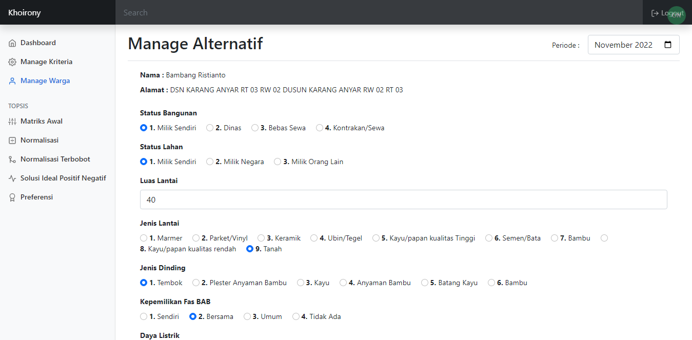
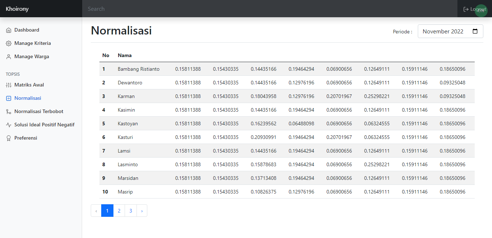

# SISTEM PENDUKUNG KEPUTUSAN PENENTUAN PENERIMA BANTUAN SOSIAL MENGGUNAKAN METODE TOPSIS
   
### Tampilan Antar Muka
1. Halaman Login  
  

2. Halaman Register  
  

3. Halaman Dashboard  
  

4.	Halaman Manage Kriteria  
  
 
5. Halaman Tambah Kriteria  
  

4. Halaman Edit Kriteria  
  

7. Halaman Kelola Sub Kriteria  
  

8. Halaman Tambah Sub Kriteria  
  

9. Halaman Edit Sub Kriteria  
  

10.	Halaman Manage Warga  
  

11. Halaman Tambah Warga  
  

12. Halaman Edit Warga  
  
	
13. Halaman Manage Alternatif  
  

14.	Halaman Matriks Awal  
  
 
15.	Halaman Normalisasi  
  

14.	Halaman Normalisasi Terbobot  
  
 
17.	Halaman Solusi Ideal Positif dan Negatif  
  

18.	Halaman Preferensi 
  

### Conceptual Data Model 
 
  

### Physical Data Model 
 
  